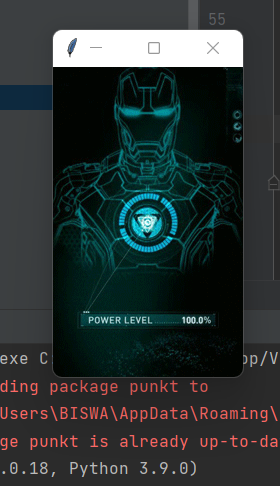
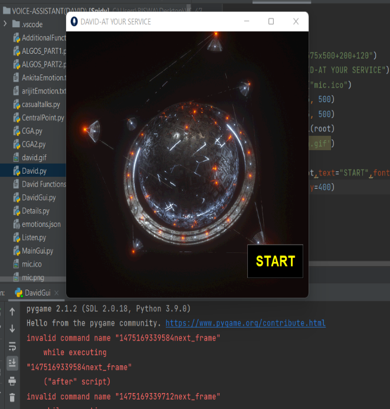
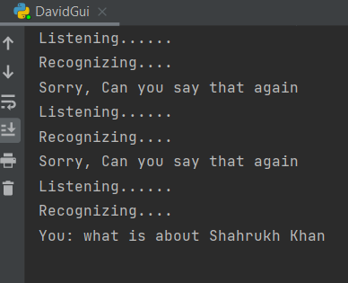
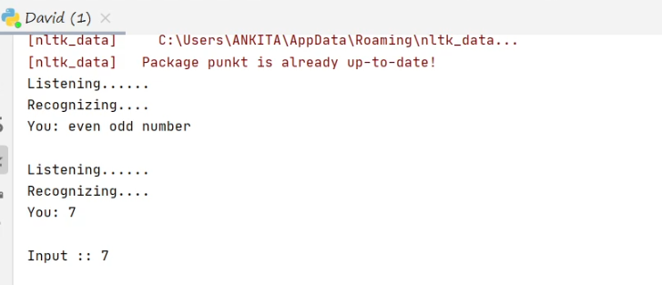
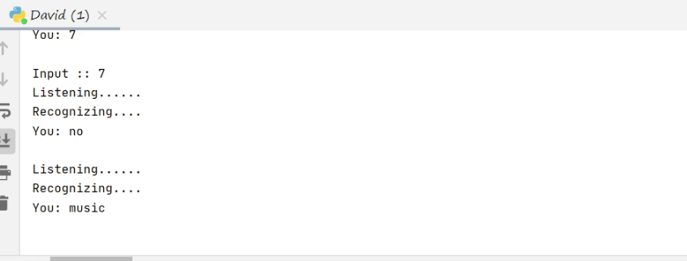

# Proj-4-UEMK-David-Voice-Assistant :open_mouth: :running: :star2:

[](https://shields.io/) [](https://shields.io/)[](https://shields.io/) [](https://shields.io/) [](https://shields.io/) [](https://shields.io/) [](https://shields.io/) [](https://shields.io/) [](https://shields.io/) [](https://shields.io/) [](https://shields.io/) 
<br>

***This new David Voice Assistant using Natural Language Processing is created by Biswarup Bhattacharjee, student of BTECH, in University of Engineering and Management, Kolkata.***

**Email Id: bbiswa471@gmail.com.** 

**Contact No: 916290272740.** 


<p align="left">
<a href="https://www.facebook.com/profile.php?id=100070395300810" target="blank"></a>
<a href="https://instagram.com/biswarup2210" target="blank"></a>
<a href="https://github.com/biswa2210" target="blank"></a>
</p>

## About David :point_down: 

<div align="justified">
    
This project is a voice assistant made using Natural Language Processing. We have
created this project using tkinter, pygame, pillow, torch, pywhatkit, pyttsx3, itertools 
module in python. <br>
**Train.py→**We have trained our model for this project and saved it. The model is saved 
as model.pth. We have used torch module and tnn for machine learning portion. We 
have calculated the loss and accuracy of our model. Epoch is 1000, batch size is 8 and 
learning rate is 0.001.<br>
**Test.py→**time, date, shutdown, restart, countdown, alarm, accessing google, 
temperature, Wikipedia, maps, you tube these functions are added in this portion.
Technicaltalks.py→We have added many technical terms and there definitions in this 
potion and make David say it.<br>
**Say→** For all the speeches of David we have created this portion. We have used 
pyttsx3 module in python. Speak, speakalgo, speakNCS, speakAF, wish these are the 
functions here. We have set all the speed and voice here.<br>
Neuralnetwork.py and Centralpoint.py→We have made tokenize and bag-of-words in 
this part for the brain of David.<br>
**NCS part1 and 2→**Here we have added number checking functions for checking 
number as per user’s given command as input to David. We have to say the number 
and if David doesn’t understand that it will give us an option to type the input 
manually.<br>
**Listen.py→**In this section we made David listen our command using device’s 
microphone.<br>
Emotions.json→In this file we have added all the tasks for David in form of 
dictionary. We have added tags, patterns and responses for each task.
**CGA1 and 2→** Here we have created google automation. After David answers our 
questions on algorithms or number checking David asks if it will take us to google for 
more study or not. If we say yes then it will take us to google searching that result or it 
will go for next task.<br>
**Algos part 1 and 1→**Here we have added 72 algorithms’ task. Searching, sorting and 
other type of algorithms are there. When we name a algorithm it will define it nicely 
and take us to google automation if we say yes.<br>
**Causaltalks.py→**Here we have added casual talks for interaction and daily days’
normal talks. David will answer many common questions of normal life style.
Additional Functionality→Here we have added addition, subtraction, multiplication, 
division and pascaltriangle functionalities for making it more useful.<br>
**David.py→**We have imported all our works here for integrating the entire project to 
work as a voice assistant.<br>
**David_gui.py→**A graphical user interface helps users to interact freely with a system. 
So, we have added a gui section in our project DAVID. Here we have used tkinter 
module for creating gui canvas. In the main gui for loading the gif image we have 
used itertools module in our custom class imagelabel class in davidgui.py. Here we 
have added a START button and designed the button for better look. We have added 
gif using pillow module in the canvas. Clicking on this button we can start the voice 
assistant. Here is no button for exit. When we give the command to quit then we can 
exit.

</div>

## DAVID VOICE ASSISTANT DEMO VIDEO: :point_right: <a href="https://www.youtube.com/watch?v=ls2WjgyJicg&list=PL0lbDlMJ1h4jrRuH-A6njkMA3iYmRhxIO&index=5">Click here to watch</a>

## AIML-DL PLAYLIST: :point_right: <a href="https://www.youtube.com/watch?v=K0AAxrbzLFg&list=PL0lbDlMJ1h4jrRuH-A6njkMA3iYmRhxIO">Click here to watch</a>

### :point_right: <a href="https://drive.google.com/file/d/1iSP2SuXuZOaPTGCE2pPKsgEIwaXckAPY/view">Click here to read documentation</a>

## Purpose :point_down:

<div align="justified">

A virtual voice assistant is meant to be made using natural language processing in 
machine learning. A user-friendly graphical user interface should be made. Different 
system tasks like date, time, day, shut down pc, set alarm these should be added. At 
least 50 different algorithms should be learnt by the assistant so that it could be used 
for study. Number Checking should be performed by the assistant. Google 
Automation should be added to for more convenience.
    
</div>

## Folder Structure :point_down:

```bash
DAVID-VOICE-ASSISTANT
    ├── Train.py
    ├── Test.py
    ├── Say.py
    ├── NCS1.py
    ├── NCS2.py
    ├── listen.py
    ├── CGA1.py
    ├── CGA2.py
    ├── Algo1.py
    ├── Algo2.py
    ├── Casualtalks.py
    ├── technicaltalks.py
    ├── David.py
    └── David_gui.py
```
    
## Screenshots :point_down: 

<div align="center">
    
<a href="david0.png"></a> <a href="davidd.png"></a> <a href="davi.png"></a>
    
<a href="david.png"></a> <a href="david1.png"></a>

</div>

